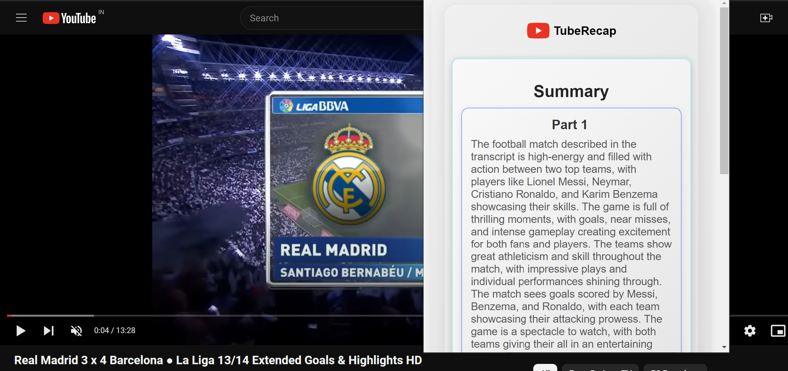

# TubeRecap - Chrome Extension

Introducing TubeRecap, the revolutionary Chrome/Browser extension designed to transform your YouTube experience by providing concise and insightful summaries of long videos and podcasts. Say goodbye to spending hours watching content when you can get the essence of it in just a few lines! Whether you're a busy professional, a student, or just someone looking to optimize your viewing time, TubeRecap is here to enhance your productivity and keep you informed.

TubeRecap uses cutting-edge AI technology to analyze and distill the key points of lengthy videos and podcasts into summaries ranging from 10 to 50 lines, depending on the video's duration and content complexity. This powerful tool ensures you capture the core message and critical details without the need to watch the entire video.

Once fully developed, TubeRecap will be made available to the public, providing an invaluable resource for anyone who values their time and wants to stay up-to-date with the latest content efficiently. With TubeRecap, you can effortlessly keep up with your favorite creators, educational content, news updates, and more—all in a fraction of the time.

Experience the future of video consumption with TubeRecap. Streamline your learning, stay informed, and reclaim your time with the ultimate video summarization tool. Get ready to revolutionize the way you watch YouTube!

## Features

- Summarize YouTube videos into key points.
- Easy-to-use interface.
- Customizable settings.

## Usage
1. Navigate to a YouTube video.
2. Click on the TubeRecap extension icon in the Chrome toolbar.
3. The extension will summarize the video for you.

## Dev and Installation

1. Clone the repository:

   ```bash
   git clone https://github.com/SiddharthaBose30/TubeRecap.git
   cd TubeRecap 
   npm install
   update the API_KEY in App.tsx from OpenAI APIs dashboard
   npm run build
2. Load the extension in Chrome
3. Open Chrome and go to `chrome://extensions/`.
4. Enable "Developer mode" in the top right corner.
5. Click on "Load unpacked" and select the `build` folder from the project directory.
6. The TubeRecap extension should now be installed and ready to use.

## Sample Image




## Contributing
Contributions are welcome! Please feel free to submit a pull request or open an issue if you encounter any bugs or have any suggestions for improvements.   
